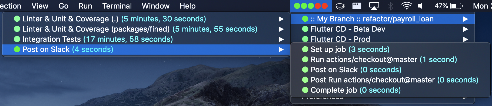
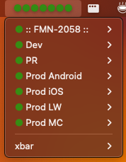
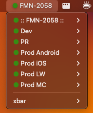

# BitActions - Github Actions status for a specific Github repository on macOS menu bar

Inspired by [Hukum](https://github.com/abskmj/hukum) BitActions is a BitBar plugin that displays Github Actions status for a specific Github repository in your Mac OS X Menu Bar.
It is good for watching a regular Github workflow setup from your project, but also to allow you to filter a specific branch that you are working on in a pull request workflow.

## Example



## Prerequisites

- [Node.js](https://nodejs.org/)
- [XBar](https://xbarapp.com/)
- Open xbar

## Installation

Make sure you have `node` and `npm`, then run:
```sh
curl https://raw.githubusercontent.com/paulononaka/bitactions/master/install.sh | bash
```

## Configuration

Create a `.bitactionsrc` file in your $HOME with the following content:

```json
{
    "githubToken": "<Your personal classic Git hub token. Ex: aaa_xxxxxxxxxxxxxxxxxxxxxxxxxxxxxxxxxxxxxxxx>",
    "githubRepoName": "You can get it from the end of the GithHub URL of the project you want to watch.. Ex: acme_corporation/my_project>",
    "localRepoPath": "<Full path of your repo in your local machine. This will serve to automatically watch the branch you are. Ex: /Users/paulononaka/codes/bitactions>",
    "watchBranchName": "<Branch name to watch when local branch does not have any runs on GitHub. Ex: main>",
    "statusMode": "<branch OR summary OR rotate. Ex: branch>"
}
```

After the configuration, click on xbar your on Mac OS bar and refresh it. Wait a few seconds for the first Github request and voalá. The plugin should starts working.

## githubToken
// **Optional** for public repos, required for privated ones - Your personal classic Git hub token. A forty-digit alphanumeric string.

TLTR: Follow these steps at [docs.github.com](https://docs.github.com/en/authentication/keeping-your-account-and-data-secure/managing-your-personal-access-tokens#creating-a-personal-access-token-classic) to create a personal token (classic).

BitActions uses [Github Actions API](https://docs.github.com/en/rest/reference/actions). It is possible to use these APIs without any authentication for public repositories. However, for unauthenticated requests, the rate limit allows for up to 60 requests per hour (Details at [docs.github.com](https://docs.github.com/en/rest/overview/resources-in-the-rest-api#rate-limiting)). Authenticated requests have higher limits, up to 5000 requests per hour.

The token does not need to have any specific scope for public repositories. However, the token  needs to have `repo - Full control of private repositories` scope for private repositories.

## githubRepoName
// **Required** - Github owner/name. Ex: paulononaka/bitactions

You can get it from the end of the GithHub URL of the project you want to watch.
Ex: `https://github.com/acme_corporation/my_project` becomes `acme_corporation/my_project`.

## localRepoPath
// **optional** - Ex: /Users/paulononaka/codes/bitactions

Say you have a workflow that triggers `on: pull_request`. GitHub Actions keeps one workflow for all pushed branches so the last run might not be the branch that you are working on locally, the one you really want to monitor.

Given that, set this option if you wish to watch specifics branches you are working on locally. If you set it, a submenu with the workflow will monitor this branch. If you wish the status also appears in the main Mac OS menu bar, set `statusMode` to `branch`.

Please notice that this feature uses the local branch from a local repo, so if you change the branch locally the submenu will attempt to search for that branch and if it isn't pushed yet (has no runs) it won't be displayed.

## watchBranchName
// **required** - Ex: main

This will be the monitored branch if you set `statusMode` to `branch`, but your local branch has no runs yet.

## statusMode
// **Optional** - branch, rotate or summary. Ex: summary

Choose how the macOS menu bar should appear in the macOS bar menu:

- summary - Shows all workflows at once, without workflows names.



- rotate - Rotates the workflow with its name, showing one at a time.


- branch - Fixes the status to the branch you are working on your `localRepoPath`.



##

# How it works?
BitActions uses [Github Actions API](https://docs.github.com/en/rest/reference/actions) to get the related workflow to the recent git push and its status. It keeps on calling the APIs every time your Xbar refreshes.

# Contributing

Contribution with code or documentation by raising a [pull request](https://github.com/paulononaka/bitactions/pulls) are more than welcome! Head over to the [issues tab](https://github.com/paulononaka/bitactions/issues) to report any bug or suggest an improvement. 